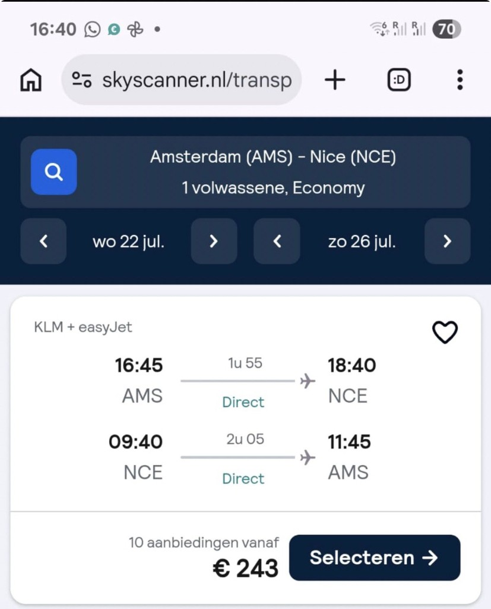

# Vervoer

Vluchten, treinen en de ferry. Prijzen zijn indicatief (juli 2026).

---

## ✈️ Vluchten (AMS ↔ NCE) — ✅ geboekt

KLM + easyJet, beide **direct**. Vanaf ~€243 retour p.p. (Skyscanner-vondst).
De vluchten zijn **geboekt** (AMS→NCE 22/7 16:45, NCE→AMS 26/7 09:40).

| Richting | Datum | Vertrek | Aankomst | Duur |
|----------|-------|---------|----------|------|
| **AMS → NCE** | woe 22 jul | 16:45 | 18:40 | 1u55 |
| **NCE → AMS** | zon 26 jul | 09:40 | 11:45 | 2u05 |

> Zondag vertrek is vroeg (09:40) → op tijd uitchecken en naar de luchthaven.

---

## 🚆 Trein Cannes → Nice (donderdag 23 juli)

- **Operator:** SNCF — TER (regionaal), soms TGV INOUI / OUIGO
- **Duur:** ~27–40 min (gemiddeld 36 min), **direct**
- **Prijs:** ~€10 p.p. (TER vaste prijs; soms goedkoper in de voorverkoop)
- **Frequentie:** ~70–95 treinen per dag → geen stress, gewoon instappen
- **Boeken:** [SNCF Connect](https://www.sncf-connect.com/en-en/train/route/cannes/nice) of Trainline (QR-code in de app)

**Aanpak:** ontbijt in Cannes, dan late-ochtend/vroege-middag trein pakken. Geen
reservering nodig voor TER — kaartje vooraf of aan het station kopen.

### Luchthaven (NCE) → Cannes (woensdag)
- Trein of bus vanaf luchthaven naar Cannes (~30–45 min). Er is o.a. buslijn 81/210
  richting Cannes en treinverbinding via Nice-St-Augustin / Nice-Ville.
- Check ter plekke de snelste optie met bagage voor 7 personen.

---

## ⛴️ Ferry Nice → Monaco (zaterdag 25 juli)

**Trans Côte d'Azur** is de enige aanbieder. Prachtige tocht langs de Côte d'Azur (~45 min).

- **Dagen 2026:** dinsdag, donderdag, **zaterdag** ✅ (zaterdag 25 juli werkt!)
- **Vertrek Nice:** 09:30 (Port de Nice, **Quai Lunel**)
- **Aankomst Monaco:** 10:15
- **Terug — vertrek Monaco:** 17:00 → **aankomst Nice 18:00**
- **Prijs:** €49,50 p.p. (volwassene), retour met stop in Monaco
- **Reservering:** **VERPLICHT** (zie hieronder)

### ✅ Reserveren — BESLIST: ja, doen (7 plekken, za 25 juli)

Reservering is verplicht én de boten zitten in de zomer snel vol → **z.s.m. boeken**.

- **Wat:** 7 × volwassene, retour Nice → Monaco met stop, **zaterdag 25 juli 2026**
  (heen 09:30 / terug 17:00)
- **Totaalprijs:** 7 × €49,50 = **~€346,50**
- **Hoe boeken (kies één):**
  1. **Online:** [trans-cote-azur.com — croisières Nice–Monaco](https://www.trans-cote-azur.com/croisieres/croisieres-nice-monaco/)
  2. **Telefoon:** +33 (0)6 01 52 54 08 of +33 (0)4 92 00 42 30
  3. **E-mail:** croisieres@trans-cote-azur.com
- **Instappunt:** Port de Nice, **Quai Lunel** — wees op tijd (±20 min van tevoren).

> **Deadline:** geen harde datum, maar zomerse zaterdagen lopen vol → deze week
> regelen. Eén persoon boekt voor de hele groep en verdeelt de kosten.

> Alternatief (goedkoper, geen stop): 2-uur "Promenade / Sightseeing" cruise om
> 16:00 voor €39,50 — maar dat is alléén varen langs de kust, **geen tijd in
> Monaco**. Wij willen de **cruise met stop** (09:30 heen / 17:00 terug).

### 🔄 Later heen / eerder terug? — flexibele alternatieven

Vraag uit de groep: *"kunnen we ook later met de ferry naar Monaco en eerder
terug?"* Kort antwoord: **met de ferry niet.**

- **De ferry is een vaste tocht.** *Geverifieerd (trans-cote-azur.com, 2026):* de
  "croisière avec escale" heeft maar **één afvaart** — heen **09:30**, terug
  **17:00**. Er zijn geen extra Monaco-tijden. De enige andere boot is de
  Promenade-cruise van 16:00, maar die **stopt niet** in Monaco.
- **En één kant per boot?** Kan ook niet: Trans Côte d'Azur verkoopt **alleen
  retour** (geen los enkeltje). *(Geverifieerd — een echt enkele reis over water
  bestaat alleen als dure privé-watertaxi, ~€300+; niet interessant.)* Dus "ferry
  heen, trein terug" gaat helaas niet op met deze rederij.

**Wil je flexibel zijn met de tijden → pak de trein of de bus.** Die vertrekken de
hele dag door, dus je gaat wanneer je wilt en komt terug wanneer je wilt.

| Optie | Reistijd | Prijs p.p. (enkel) | Frequentie / tijden | Sfeer |
| --- | --- | --- | --- | --- |
| **⛴️ Ferry (met stop)** | ~45 min | €49,50 **retour** | **vast**: 09:30 heen / 17:00 terug (di/do/za) | mooiste, maar vaste tijden + reserveren |
| **🚆 Trein** (Nice-Ville ↔ Monaco-Monte-Carlo) | ~20–25 min | **€5,90** (vol tarief) | **~elke 15–20 min**, ~05:50–22:20, geen reservering | snelst & flexibelst |
| **🚌 Bus 600** (ex-lijn 100) | ~75–90 min | **€2,10** (contactloos) / €2,50 cash | elke ~15–20 min, ~7 dagen | goedkoopst + scenic langs de kust |

*Alle drie geverifieerd (SNCF/TER + Zou!/Lignes d'Azur, 2026).*

- **Trein** — Nice-Ville → **Monaco-Monte-Carlo**, direct, ~20 min. Vol tarief
  **€5,90 enkel**; met **7 personen** kun je het **ZOU! mini-groepstarief (~€3
  p.p. vanaf 5 pers.)** pakken → nóg goedkoper. Rijdt ~55–65 keer per dag, geen
  reservering, kaartje via SNCF Connect-app of automaat. **Dit is de flexibele
  optie: later heen én eerder (of juist later) terug, geheel naar eigen zin.**
- **Bus 600** (heette vroeger **lijn 100**) — de klassieke **scenic kustroute**
  via Villefranche, Beaulieu, Èze-sur-Mer en Cap-d'Ail. Langzamer (~1u15–1u30) en
  kan vol zitten, maar spotgoedkoop en prachtig uitzicht. €2,10 contactloos aan
  boord (of €2,50 cash); mini-groepskorting mogelijk. *Let op: Monaco is een
  ander land, dus een Nice-dagpas dekt de rit tot ín Monaco niet volledig.*

> **Advies:** wil je de **beleving** → doe de **ferry** (mooiste tocht, maar dan
> wél de vaste 09:30/17:00 en reserveren). Wil je **vrij zijn in tijd** (later weg,
> eerder terug) → pak de **trein** (~20 min, ~€5–6, hele dag door). De bus is het
> goedkoopst en scenic, maar traag. Combineren "ferry heen + trein terug" kan
> helaas niet (ferry is retour-only).
